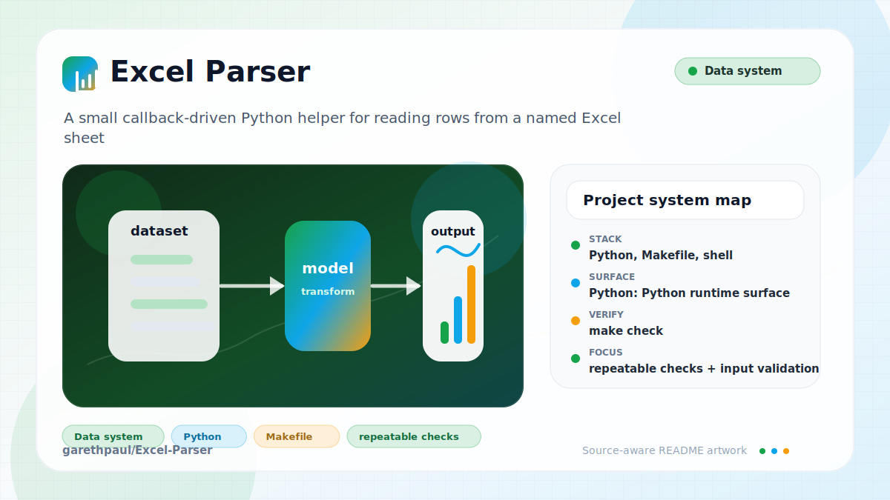

# Excel-Parser

<!-- README-OVERVIEW-IMAGE -->


## Overview

`garethpaul/Excel-Parser` is a small callback-driven Python helper for reading
rows from a named Excel sheet with `xlrd` and converting cell values into
declared target types.

The parser preserves its callback-driven API while using a maintained Python
3.10-or-newer runtime for conversion, workbook integration, and callback tests.

## Repository Contents

- `parse.py` - Excel row processor and conversion helpers
- `tests/test_parse.py` - synthetic fake-workbook parser tests
- `tests/test_xls_integration.py` - temporary real `.xls` integration coverage
- `requirements.txt` - `xlrd` dependency range for real `.xls` workbook parsing
- `requirements-dev.txt` - pinned audit and synthetic workbook test tools
- `Makefile` - local verification entry point
- `CHANGES.md` - maintenance history
- `SECURITY.md` - security reporting and disclosure guidance
- `VISION.md` - project direction and maintenance guardrails

## Getting Started

### Prerequisites

- Git
- Python 3.10 or newer
- `xlrd>=2.0.1,<3` when processing real `.xls` workbook files

### Setup

```bash
git clone https://github.com/garethpaul/Excel-Parser.git
cd Excel-Parser
python3 -m pip install -r requirements.txt
```

Install `requirements-dev.txt` as well when running the maintenance suite:

```bash
python3 -m pip install -r requirements.txt -r requirements-dev.txt
```

The tests use fake workbook objects for focused cases and generate a temporary
synthetic `.xls` workbook for the real `xlrd` integration path. No workbook
fixture is committed. Modern `.xlsx` support is intentionally not claimed by
this baseline.

## Running or Using the Project

- Instantiate `ExcelProcessor(row_callback, done_callback, exception_callback)`
  from `parse.py`.
- Call `process(path, sheet_name, has_header, cell_types)` with target cell
  types such as `ExcelProcessor.CELL_TEXT`, `CELL_INT`, and `CELL_FLOAT`.
- Callbacks are validated before opening a workbook. Row and completion
  callbacks must be callable; the exception callback must be callable or `None`.
- Use `ExcelProcessor.CELL_EMPTY` in `cell_types` to ignore a present source
  cell and receive `None` for that output position.
- Target cell type declarations are validated before opening workbooks, so
  invalid output schemas fail before file resources are touched.
- Target cell type declarations must use exact integer constants; booleans and
  numerically equal floats are rejected instead of being treated as schema
  aliases.
- Workbook paths are validated as non-empty .xls paths before opening files,
  matching the documented `xlrd` 2.x `.xls` boundary.
- Sheet names must be non-empty strings and `has_header` must be a real boolean;
  invalid processing options fail before workbook files are opened.
- Numeric cells convert to `CELL_INT` only when the value is integer-valued;
  fractional numbers raise `InvalidDataException` instead of being truncated.
- Text cells requested as numeric targets reject blank or malformed text with
  `InvalidDataException`.
- non-string text cells are rejected with `InvalidDataException` before text,
  integer, or float conversion.
- Non-finite numeric values such as `nan` and `inf` are rejected before they
  reach callbacks, including when numeric cells are requested as text.
- Conversion errors summarize long, multiline, or unprintable values before raising
  `InvalidDataException`.
- Date conversion is intentionally unsupported and raises
  `InvalidDataException`.

## Testing and Verification

Run the local maintenance gate:

```bash
make check
make lint
make test
make build
```

`make check` runs Python 3 unit tests with synthetic workbook data, including a
temporary real `.xls` file, compiles the parser and tests, and audits pinned
dependencies. `make lint` runs the full maintenance baseline, `make test` runs
the unittest suite, and `make build` compiles the parser and tests. The public
`ExcelProcessor` constructor and `process` callback signatures remain covered
while dormant `basestring`, `long`, and Python 2 syntax branches are removed.
GitHub Actions performs clean installs and runs the same `make check` baseline
on Python 3.10, 3.12, and 3.14 for pushes, pull requests, and manual
dispatches. Workflow actions are pinned by commit and repository access is
read-only. The workflow does not persist checkout credentials after source
retrieval.

When the required SDK or runtime is unavailable, use static checks and source review first, then verify on a machine that has the matching platform toolchain.

## Configuration and Secrets

- No required secret or credential file was identified in the repository scan. If you add integrations later, keep secrets out of git.

## Security and Privacy Notes

- Review changes touching file, media, JSON, XML, CSV, OCR, or data parsing; examples from the scan include parse.py.
- Use synthetic spreadsheets or fake workbook objects in tests. Do not commit
  private spreadsheet data.
- Parser errors should avoid dumping full row contents unless a caller
  explicitly asks for that behavior.
- Keep `xlrd` and `pip-audit` pinned and update them through reviewed dependency
  changes that run the full matrix.
- Keep real workbook tests synthetic and temporary; `xlwt` is a test-only
  dependency and production parsing remains limited to `xlrd`.

## Maintenance Notes

- See `SECURITY.md` for vulnerability reporting and safe research guidance.
- See `VISION.md` for project direction and contribution guardrails.
- See `docs/plans/2026-06-08-excel-parser-maintenance-baseline.md` for the
  current parser maintenance baseline.
- See `docs/plans/2026-06-08-fractional-int-conversion.md` for numeric
  integer-conversion guardrails.
- See `docs/plans/2026-06-09-text-number-conversion-errors.md` for
  text-to-number conversion error guardrails.
- See `docs/plans/2026-06-09-non-finite-number-conversion.md` for non-finite
  numeric conversion guardrails.
- See `docs/plans/2026-06-09-non-finite-number-text-conversion.md` for
  non-finite numeric-to-text conversion guardrails.
- See `docs/plans/2026-06-09-text-cell-value-validation.md` for non-string
  text-cell validation.
- See `docs/plans/2026-06-09-conversion-error-value-summary.md` for bounded
  conversion error value summaries.
- See `docs/plans/2026-06-09-target-cell-type-validation.md` for target cell
  type validation before workbook access.
- See `docs/plans/2026-06-09-workbook-path-validation.md` for workbook path
  validation before workbook access.
- See `docs/plans/2026-06-10-ci-baseline.md` for the GitHub Actions baseline.
- See `docs/plans/2026-06-10-processing-option-validation.md` for strict cell
  type, sheet name, and header flag validation before workbook access.
- See `docs/plans/2026-06-12-real-xls-integration-coverage.md` for the real
  `.xls` integration contract.
- See `docs/plans/2026-06-12-checkout-credential-boundary.md` for the hosted
  checkout token boundary.
- See `docs/plans/2026-06-13-callback-validation.md` for the fail-fast callback
  configuration boundary.

## Contributing

Keep changes small and tied to the project that is already present in this repository. For code changes, document the toolchain used, avoid committing generated dependency directories or local configuration, and update this README when setup or verification steps change.
